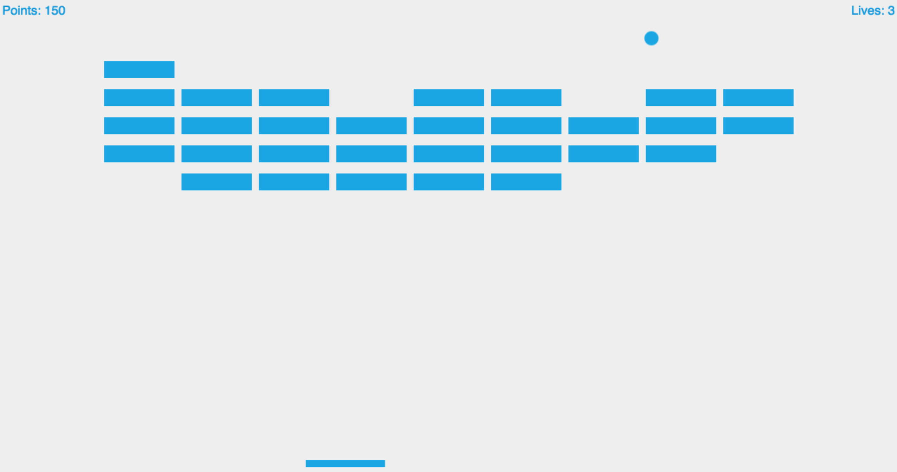

So I'm entering the <a href="https://github.com/blog/2459-and-the-theme-for-game-off-2017-is" target="_blank" rel="nofollow noopener noreferrer">GitHub Game Off 2017</a> to level up my game development skills in a short space of time. As I'm immersed in JavaScript, I'm sticking with <a href="https://phaser.io" target="_blank" rel="nofollow noopener noreferrer">Phaser</a> for development \- an awesome HTML5 game framework. Phaser, including the upcoming version 3 due later this year, is built with ES5. I'm trying to standardize my workflow with ES2015+ for all projects, so to test how that'll work with Phaser I followed the Mozilla Development Network's <a href="https://developer.mozilla.org/en-US/docs/Games/Tutorials/2D_breakout_game_Phaser" target="_blank" rel="nofollow noopener noreferrer">breakout tutorial</a> while translating the code to ES2015. For those absolutely new to Phaser, I definitely recommend the tutorial but using ES2015+ isn't necessary at all. If you choose, you can look at my code below for reference:

```javascript
import Phaser from 'phaser';

class Game extends Phaser.Game {
  constructor (width, height, mode, domElement='content', arg=null) {
    super(width, height, mode, domElement, arg);
    this.state.add('Game', GameState, true);
  }
}

class GameState extends Phaser.State {
  constructor() {
    super();
    this.ball = null;
    this.paddle = null;
    this.bricks = null;
    this.brickInfo = null;
    this.score = 0;
    this.scoreText = null;
    this.lives = 3;
    this.livesText = null;
    this.lifeLostText = null;
    this.textStyle = {
      font: '18px Helvetica',
      fill: '#0095DD'
    };
    this.playing = false;
    this.startButton = null;
    this.ballHitPaddle = this.ballHitPaddle.bind(this);
    this.initBricks = this.initBricks.bind(this);
    this.ballHitBrick = this.ballHitBrick.bind(this);
    this.ballLeaveScreen = this.ballLeaveScreen.bind(this);
    this.startGame = this.startGame.bind(this);
  }

  preload() {
    this.scale.scaleMode = Phaser.ScaleManager.SHOW_ALL;
    this.scale.pageAlignHorizontally = true;
    this.scale.pageAlignVertically = true;
    this.stage.backgroundColor = '#eeeeee';
    this.load.image('ball', 'assets/sprites/ball.png');
    this.load.image('paddle', 'assets/sprites/paddle.png');
    this.load.image('brick', 'assets/sprites/brick.png');
    this.load.spritesheet('ball', 'assets/sprites/wobble.png', 20, 20);
    this.load.spritesheet('button', 'assets/sprites/button.png', 120, 40);
  }

  create() {
    this.physics.startSystem(Phaser.Physics.ARCADE);
    this.physics.arcade.checkCollision.down = false;

    this.ball = this.add.sprite(this.world.width * 0.5, this.world.height - 50,
      'ball');
    this.ball.animations.add('wobble', [0, 1, 0, 2, 0, 1, 0, 2, 0], 24);
    this.physics.enable(this.ball, Phaser.Physics.ARCADE);
    this.ball.body.collideWorldBounds = true;
    this.ball.checkWorldBounds = true;
    this.ball.events.onOutOfBounds.add(this.ballLeaveScreen, this);
    this.ball.body.bounce.set(1);

    this.paddle = this.add.sprite(this.world.width * 0.5,
      this.world.height - 10, 'paddle');
    this.paddle.scale.setTo(1.5, 1);
    this.paddle.anchor.setTo(0.5, 1);
    this.physics.enable(this.paddle, Phaser.Physics.ARCADE);
    this.paddle.body.collideWorldBounds = true;
    this.paddle.body.immovable = true;

    this.initBricks();
    this.bricks = game.add.group();
    // Add bricks
    for (let c = 0; c < this.brickInfo.count.col; c++) {
      for (let r = 0; r < this.brickInfo.count.row; r++) {
        let brickX = (r * (this.brickInfo.width + this.brickInfo.padding))
          + this.brickInfo.offset.left;
        let brickY = (c * (this.brickInfo.height + this.brickInfo.padding))
        + this.brickInfo.offset.top;
        let newBrick = this.add.sprite(brickX, brickY, 'brick');
        this.physics.enable(newBrick, Phaser.Physics.ARCADE);
        newBrick.body.immovable = true;
        newBrick.scale.setTo(2, 1.2);
        newBrick.anchor.set(0.5);
        this.bricks.add(newBrick);
      }
    }

    this.scoreText = this.add.text(5, 5, `Points: ${this.score}`, this.textStyle);

    this.livesText = this.add.text(this.game.world.width - 5, 5,
      `Lives: ${this.lives}`, this.textStyle);
    this.livesText.anchor.set(1,0);
    this.lifeLostText = this.add.text(this.world.width * 0.5,
      this.world.height * 0.5, 'Life lost, click to continue', this.textStyle);
    this.lifeLostText.anchor.set(0.5);
    this.lifeLostText.visible = false;

    this.startButton = this.add.button(this.world.width * 0.5,
      this.world.height * 0.5, 'button', this.startGame, this, 1, 0, 2);
    this.startButton.anchor.set(0.5);
  }

  update() {
    this.physics.arcade.collide(this.ball, this.paddle, this.ballHitPaddle);
    this.physics.arcade.collide(this.ball, this.bricks, this.ballHitBrick);
    if (this.playing) {
      this.paddle.x = this.input.x || (this.world.width * 0.5);
    }
  }

  initBricks() {
    this.brickInfo = {
      width: 100,
      height: 30,
      count: {
        row: 9,
        col: 5
      },
      offset: {
        top: 100,
        left: 200
      },
      padding: 10
    };
  }

  ballHitPaddle(ball, paddle) {
    ball.animations.play('wobble');
    ball.body.velocity.x = -1 * 5 * (paddle.x - ball.x);
  }

  ballHitBrick(ball, brick) {
    let killTween = this.add.tween(brick.scale);
    killTween.to({x: 0, y: 0}, 200, Phaser.Easing.Linear.None);
    killTween.onComplete.addOnce(() => {
      brick.kill();
    }, this);
    killTween.start();
    this.score += 10;
    this.scoreText.setText(`Points: ${this.score}`);

    let countAlive = this.bricks.filter((brick) => {
      return brick.alive;
    }).length;

    if (countAlive === 0) {
      alert('You\'ve won the game, congrats!');
    }
  }

  ballLeaveScreen() {
    this.lives -= 1;
    if (this.lives) {
      this.livesText.setText(`Lives: ${this.lives}`);
      this.lifeLostText.visible = true;
      this.ball.reset(this.world.width * 0.5, this.world.height - 50);
      this.paddle.reset(this.world.width * 0.5, this.world.height - 10);
      this.input.onDown.addOnce(() => {
          this.lifeLostText.visible = false;
          this.ball.body.velocity.set(150, -150);
      }, this);
    } else {
      alert('You lost, game over!');
      location.reload();
    }
  }

  startGame() {
    this.startButton.destroy();
    this.ball.body.velocity.set(150, -150);
    this.playing = true;
  }
}

const game = new Game('100', '100', Phaser.AUTO);

```

Works just like the original!



A major difference with my code is the use of a state, more than likely unnecessary but I just love using states even for small projects. I used this <a href="https://github.com/lean/phaser-es6-webpack" target="_blank" rel="nofollow noopener noreferrer">repo</a> to setup webpack to transpile the code. You probably noticed from the GameState constructor that the repo does not allow me to use later ESnext features - I had to bind the object's functions to preserve the context of `this` instead of defining the function as a class property. It's my first time using that repository for ES2015 but I'd prefer a tool that includes ESnext out of the box and makes less assumptions about how my code is structured. Also, as we have to clone the repo we have to readjust the git remotes if we use version control for everything (and we really should!). Someone made a <a href="https://github.com/nerdenough/phaser-cli" target="_blank" rel="nofollow noopener noreferrer">Phaser CLI</a> to fill that need but only one developer is working on it and it's not updated frequently so I'm not basing my future work on it in this current state.

Still finalizing my workflow but so far it's promising with the Phaser-ES6-Webpack setup. Best solution might be to fork and modify for my requirements. I won't stop making games because of this. ES2015 modules greatly help structure your application and remove the need for a global game variable to be referenced all over the codebase. Modules alone are good enough reason to use ES2015+ with Phaser.

Happy hacking!
