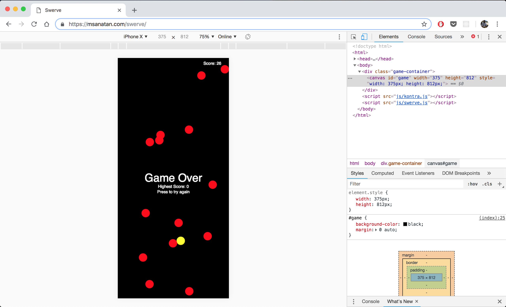

While in a car on one of T&T's many bad roads, we had to immediately dodge a deep pothole. I thought I should make a quick game about dodging potholes \- and [Kontra](https://straker.github.io/kontra/) was just the tool for throwing it out quickly.

I've been familiar with Kontra.js [before](/2018/08/31/micro-games-with-kontrajs/) so it was easy to create a working game in 2 hours late at night. In the end it's called Swerve \(I think some hip-hop I was listening kept saying that word\) and you can play it here: <https://msanatan.com/swerve/>.

## Premise

I wanted to a mobile game where players would dodge objects via touch. The longer you don't get hit, the higher the score. No need for graphics, I'll just draw shapes on the canvas.

## Kontra Setup

Kontra is very lightweight, and highly modular. The default configurations come up to 3.5KB at the time of writing, if we want touch controls then we need to add the `Pointer` code to our download.

## Scaling

The game is being developed on my laptop, but designed for mobile phones. Thankfully Chrome dev tools allows us to switch the view of our work in progress game as if we were viewing it from various phones:



This was my first attempt to scaling a game since Phaser 2's scale manager which made it dead simple. Essentially I chose a base resolution, 800 x 640, and got the dimensions of the screen. I think chose the minimum ratio of each dimension with:

```javascript
document.getElementById('game').width = window.innerWidth;
document.getElementById('game').height = window.innerHeight;
// Set resolution of canvas
document.getElementById('game').style.width = window.innerWidth + 'px';
document.getElementById('game').style.height = window.innerHeight + 'px';
const nativeWidth = 800;
const nativeHeight = 640;
const scaleRatio = Math.min(window.innerWidth / nativeWidth, window.innerHeight / nativeHeight);
```

And now every single sprite and movement would be multiplied by the scale ratio. Scaling works when everything is position relatively. I got this solution from <https://stackoverflow.com/questions/33515707/scaling-a-javascript-canvas-game-properly>. I don't like how manual this scaling is, the ideal solution would be to have the scale ratio applied throughout. For a game with this small scope it suffices.

## Adding a Menu

Managing states or scenes is a typical activity. Different levels for your platformer? They're different scenes. Game menu with options? Probably a scene too.

The first 2 hour hack basically threw a player into the game to dodge balls. Not says user friendly like absolutely no introduction. I coded a simple menu that'll allow the player to determine where it begins by pressing the play button:

```javascript
// Create a sprite to manage button clicks to start game
let playButton = kontra.sprite({
  x: kontra.canvas.width / 2,
  y: kontra.canvas.height / 2 + (100 * scaleRatio),
  color: 'red',
  radius: 100 * scaleRatio,
  textFontSize: 80 * scaleRatio,
  // Keep a flag so that we know when the button is pressed
  pointerUp: false,
  onUp() {
    this.pointerUp = true;
  },
  // Required for non-rectangular sprites to have accurate collisions
  collidesWithPointer(pointer) {
    // perform a circle v circle collision test
    let dx = pointer.x - this.x;
    let dy = pointer.y - this.y;
    return Math.sqrt(dx * dx + dy * dy) < this.radius * 2;
  },
  update() {
    // Exit thsos loop and start the game loop
    if (this.pointerUp) {
      menuLoop.stop();
      gameLoop.start();
      return
    }
  },
  render() {
    // Draw a red circle
    kontra.context.fillStyle = this.color;
    kontra.context.beginPath();
    kontra.context.arc(this.x, this.y, this.radius, 0, 2 * Math.PI, false);
    kontra.context.fill();

    // And write the word 'Play' in it
    kontra.context.fillStyle = 'white';
    kontra.context.font = `${this.textFontSize}px Verdana, Geneva, sans-serif`;
    kontra.context.textBaseline = 'middle';
    kontra.context.textAlign = 'center';
    kontra.context.fillText('Play', this.x, this.y);
  }
});

// Track player with pointer
kontra.pointer.track(playButton);

const menuLoop = kontra.gameLoop({
  update: () => {
    playButton.update();
  },
  render: () => {
    // Render the game title
    kontra.context.fillStyle = 'white';
    kontra.context.font = `${textFontSizes.title}px "Comic Sans MS", cursive, sans-serif`;
    kontra.context.textBaseline = 'middle';
    kontra.context.textAlign = 'center';
    kontra.context.fillText('Swerve', kontra.canvas.width / 2, 150 * scaleRatio);
    // Render the 'Play' button
    playButton.render();
  }
});

// Start the menu loop
menuLoop.start();
```

## Bonus: Making an App

This game is just a small website, and can be wrapped up like any other website to become an app. With the most basic `config.xml` I used <https://build.phonegap.com> to build an APK for it. This Adobe service is free for public repos. It's just a convenient, proprietary tool built on top of [Cordova](https://cordova.apache.org/), which is also free but open source to boot.

## Reflections

This was a fun exercise, and I really got even more respect for Kontra. It's super lightweight with enough baked in to give me a game in under 8 hours that's mobile friendly. Scaling is something I'd prefer to automatically managed, Phaser 2's Scale Manager has got me properly spoilt.

There are tons that can be improved with this mini-game: add music, collect items for more points, use graphics instead of just pixels. Kontra also comes with optional modules to make those upgrades straightforward. But I'm satisfied with this random creation I call Swerve. You can get the code here: <https://github.com/msanatan/swerve>

Happy game developing!
