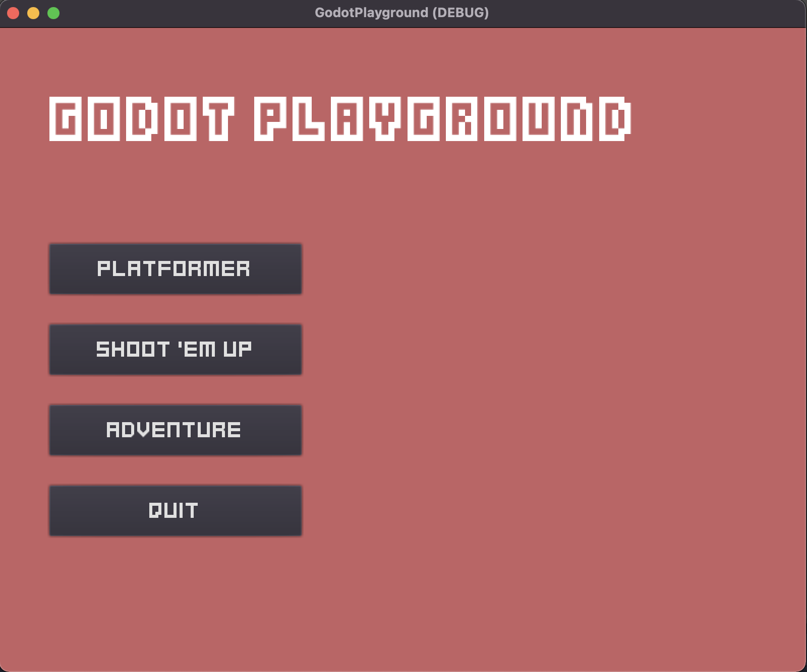
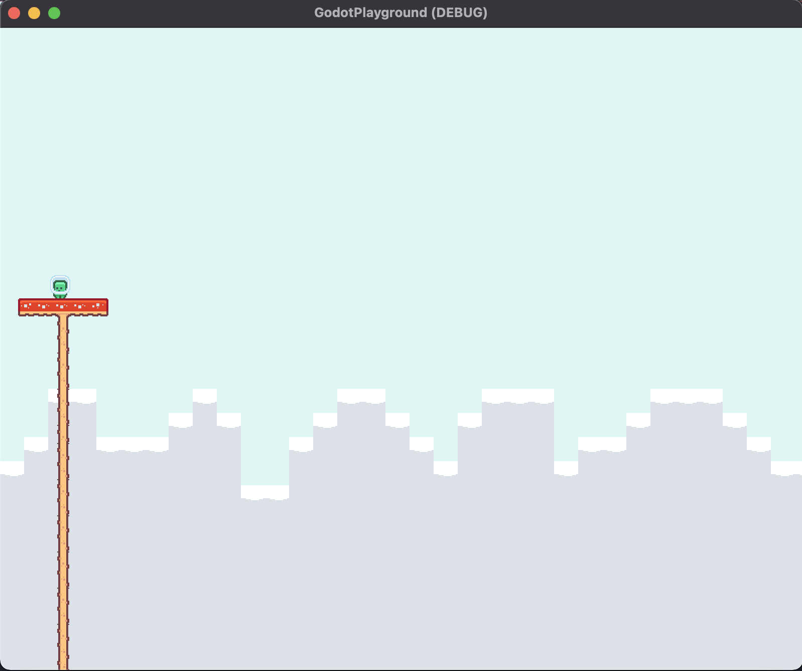
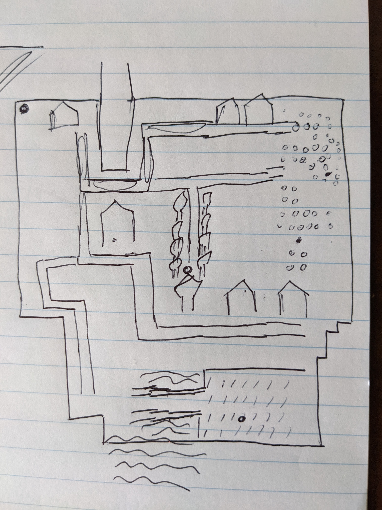
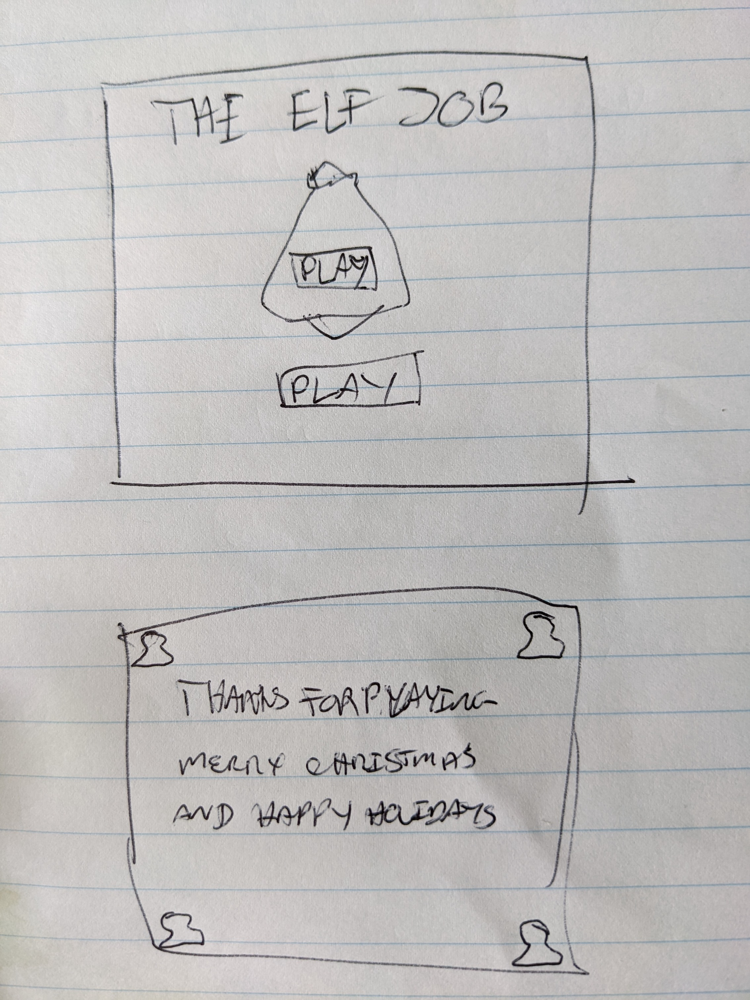
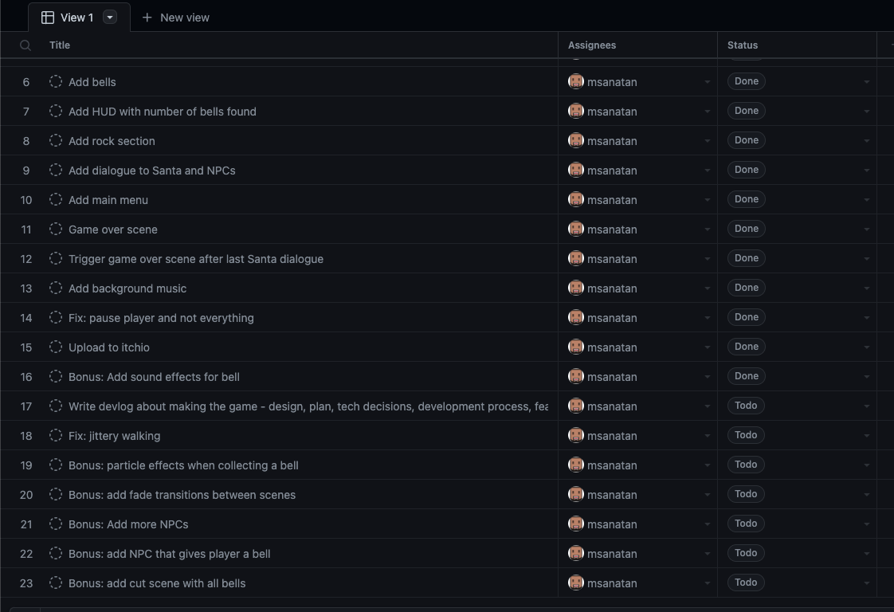
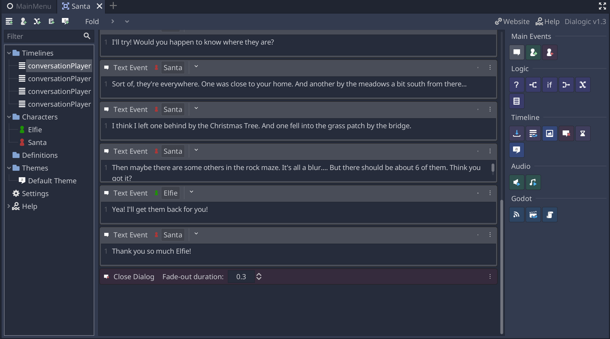
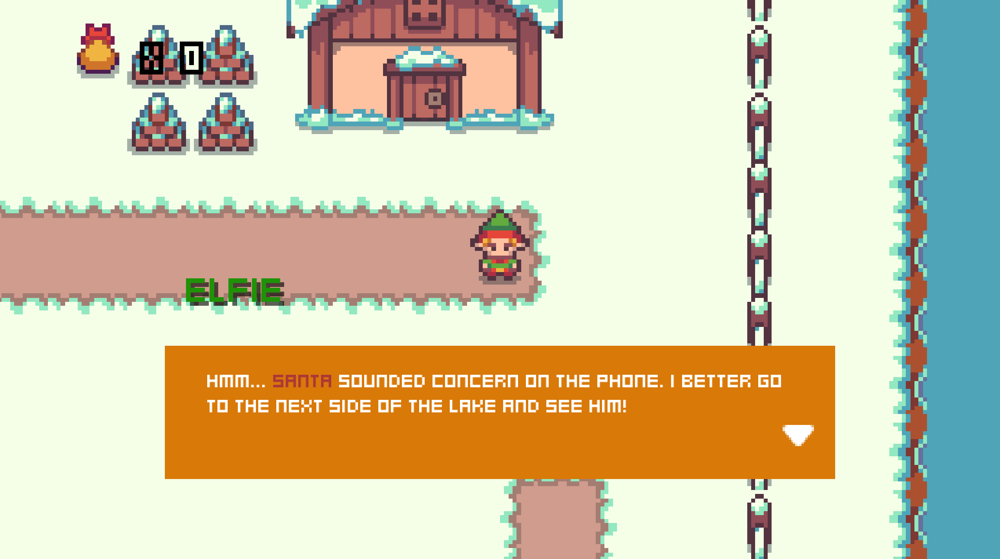

> This article was originally posted here: <https://msanatan.itch.io/the-elf-job/devlog/330254/making-the-elf-job>

Hello lovely people! I recently launched this short game, The Elf Job, and I'm pretty excited about it for many reasons. It was great to get back into Godot, and this is going to be my game engine of choice moving forward. It was the first time I made an adventure game, with dialogue like my favourite JRPGs.

This fun and success in the game jam weren't built in 2.5 day period alone. I was pretty deliberate in preparing for it.

## Preparing for the Jam

### From Unity to Godot

I've been learning Unity for most of 2021. After speaking with some career coaches, they advised I spend some time with it to increase my marketability. They were right, learning Unity opened a lot of doors \- it even gave me a one-up in my current web development job. But after a year focused on Unity, releasing two small 2D games on itch.io, and making some 3D mobile prototypes, I'm happy to put this on pause.

Unity is an excellent tool to make games. I really like the new input system, it's super flexible and works well for keyboard and mobile input. The documentation got me nowhere, but one of Unity's best strengths is the large community and availability of learning resources. I love the Device Simulator, being able to see how my mobile game works across platforms within the editor is awesome.

I didn't like a few things. The editor felt bloated, updates were simply huge. The actual project files were huge as well, even without large assets. Before updating to Windows 11, for whatever reason Unity would just crash randomly while loading my project. It just felt, buggy or badly developed. Not saying that it was, but the experience wasn't ideal.

With my experience with Godot and Phaser, 2D in Unity felt overcomplicated and fussy. I can't fully describe it, I felt like I was fighting the engine to get it to do what I want. I think if they made the unit of measurement in 2D games pixels, everything would be a lot smoother. I haven't done much 3D in Godot, but 3D in Unity felt like a more natural fit.

After a year of mostly good experiences, I felt that I'd be much quicker using Godot. I considered using C# and Godot as I'm familiar with it now. But I stuck with GDScript because it's simple to (re)learn and most guides for Godot use it. Godot's Nodes and Scenes system is also easier to grasp than the various things Unity offers. Although it's a recent return, I'm pretty happy with it.

### Practice Makes Perfect

Of course, I forgot a lot of Godot by now because of all the Unity I was learning. Getting back was fairly easy. I did the 2D tutorial all over again. I have some 3D tutorials to work on but I figured for this jam it's easier to stick with 2D as it's more familiar. Once the tutorial was finished I created a demo project. The idea of this demo project was to create small scenes to practice different mechanics. I wanted to do quick iterations for a platformer, 2D adventure, and a shoot'em up.



I only had time for the platformer, and I didn't even finish that! I'll be wrapping up HeartBeast's <a href="https://www.youtube.com/watch?v=0713nlQxU7I" target="_blank" rel="nofollow noopener noreferrer">Pixel Platformer - Godot 3.2</a> tutorial sometime soon.



The player couldn't move and the level was incomplete. But that doesn't mean this exercise was a waste. It reminded me how to build menus and scene transitions. I also relearned how to integrate Tilesets into Godot. The current implementation is a bit clunky, and I didn't fully understand it until I started this game. That said, this earlier practice helped get me back to thinking in Godot.

### VS Code

I use VS Code for everything, and Godot is no exception. The <a href="https://marketplace.visualstudio.com/items?itemName=geequlim.godot-tools" target="_blank" rel="nofollow noopener noreferrer">godot-tools</a> extension makes writing GDScript a pleasant experience. As VS Code already has git integration, it's also useful for version control. And of course, the debugger helped a lot too!

## Design

Game jams are are great times to try new mechanics. I was feeling pretty confident having switched back to Godot, and I've been playing Pokemon Brilliant Diamond recently. I love old-school JRPG style games, and I felt determined to make something similar. I like exploring worlds, creating worlds for people to experience the same joy I experience when playing games are just goals for me. Then I discovered the theme - bells.

Bells are not what I think about when I think of JRPG/adventure games. So I kept it simple. Just find them, like how we collect numerous things in adventure games. So I figured I'll create a small sandbox area. Maybe add some hidden bells. This is what I came up with:



I was hoping to get a few NPCs to speak with, some lake areas, a rocky maze to go through, and a couple of places with hidden bells (grass and trees).

One of the bells would be given to the player by an NPC, hence the dot by the house. I didn't get time to add it in, but I still was able to put some dialogue in with Santa. Through Santa, the game would "start" as he gives you direction on what needs to be done, but it ends with him.

I also did a quick sketch of the menu and game over scenes:



I didn't get time to polish everything about my game, but having a menu and an end state is basic, even for a tiny game jam game. Keep it simple and have a plan, even if things don't go according to plan (they seldom do).

One thing I was certainly adamant about when planning this game was that I'm only doing code. I looked for Christmas and winter assets that got the feel of what I wanted and thankfully found some awesome ones. I didn't get the music until later, but I wanted something to match the season.

## Project Management

For projects large and small, games and non-games, always have clear goals and a way to track progress. It's so important to see what's been done and what's coming next. After planning, the first day of dev was a lot of setup. Before I slept, I itemized everything I needed to do, and the extra things I wanted to do.

Here's how it looked like at the end of the game. A lot was done, yet so many things remaining:



Since most of my code is in GitHub, I just use GitHub Projects. Saves me from using Trello when I only need a simple task tracker.

## Game Development

### Tilemaps

2D in Godot is so easy. Well, after a year of Unity it was refreshing to be back. Movement only requires a few lines of code, and the input system is flexible for various kinds. This game works with gamepads, and it only required a few clicks! Sprite animations and collisions are straightforward to set up as well, I was able to move the player around in no time.

The trickier part was getting the Tilemaps set up. Integrating your Tileset takes time. The process is a bit tedious and requires a lot of clicking when defining collisions. It took me a while to wrap my head around auto-tiles. It didn't help that I was using Godot 3.4, which had a Tilemap bug on macOS. I lost so much time when all I needed to do was upgrade to 3.4.1.

However, once it's set up you're really good to go. Creating the level was probably the most fun I had when making this game. And now that I've had this experience, future 2D games with Tilemaps likely won't be much of a bother. That said, I can't wait for the revamped Tilemap editor in Godot 4.0 \- which looks like it has all the best features from <a href="https://www.mapeditor.org" target="_blank" rel="nofollow noopener noreferrer">Tiled</a>.

### Dialogue

I've never created a dialogue system with Godot, and though I conceptualized something with JSON I figure it would be quicker to just use one that already existed. I found <a href="https://github.com/coppolaemilio/dialogic" target="_blank" rel="nofollow noopener noreferrer">dialogic</a>, an excellent Godot plugin. The author created a couple of tutorials to get you going:

- <a href="https://www.youtube.com/watch?v=kkLqW8WhCgg" target="_blank" rel="nofollow noopener noreferrer">https://www.youtube.com/watch?v=kkLqW8WhCgg</a>
- <a href="https://www.youtube.com/watch?v=gZ3h09B7Utc" target="_blank" rel="nofollow noopener noreferrer">https://www.youtube.com/watch?v=gZ3h09B7Utc</a>

Dialogic gives an easy way to create dialogues in the UI, and a simple way to trigger them programmatically. The theming options for the dialog boxes are fantastic. I think I'll be using this for every story-driven game I have.

When the player spoke with Santa, I wanted to disable the player from moving around. How did I do this? Well, it was easy but needed a few things to set up.

First, make sure you end your dialogues with the "Close dialogue" timeline event:



Then create a function that emits a signal to indicate the player can move in the NPC's script:

```python
func unpause(timeline_name):
    # Emit signal to toggle player movement, this enables it
    emit_signal('toggle_player_move')
```

Then, when you're processing input to trigger the dialogue, do it like this:

```python
func _input(event):
    if get_node_or_null('DialogNode') == null:
        if event.is_action_pressed('ui_accept'):
            # Emit signal to toggle player movement, this disables it
            emit_signal('toggle_player_move')
            # Create the dialog
            var dialog_name = '/conversationPlayerSanta1'
            var dialog = Dialogic.start(dialog_name)
            # Connect the timeline_end signal to the unpause function created earlier
            dialog.connect('timeline_end', self, 'unpause')
            add_child(dialog) # Add dialogue
```

And on your player's script, connect to the `toggle_player_move` signal and change its state:

```python
func _on_Santa_toggle_player_move():
    can_move = !can_move
```

I was pleasantly surprised by how easy this worked, and how easy it was to work with!

## Prepping for Release

I wrapped up everything about this game roughly 1 hour before the deadline. That is a new record! With practice to process gets easier, so I thought I'd share how I submit.

The first rule is to give yourself at least 45 minutes to build and submit. Builds take time, submissions take time, and things can always go wrong. Every developer needs some breathing time to submit, and of course, test their submission. For me, The ideal time is to stop 1.5 hours before the deadline.

I did a WebGL build because that has the lowest barrier to entry to get people to try your game. I honestly recommend that everyone should do it for game jams where feasible. I tested it locally to confirm it's all good, and then followed these steps:

1. Create a new game in your Dashboard, add a description and instructions, and upload the WebGL build. Just get something basic that works as soon as possible.
2. Test your game on itch.io. Make sure that it works when you install/play it online.
3. Submit your game to the game jam. Make sure that your game is entered. We'll then work on improving the game page.
4. Add gifs to the game page
   1. Screen record interesting parts of your gameplay
   2. Convert your video file to a gif: <a href="https://ezgif.com/video-to-gif" target="_blank" rel="nofollow noopener noreferrer">https://ezgif.com/video-to-gif</a>
   3. Optimize your gif by resizing, or other means so that the file size isn't exorbitant.
5. Personalize your game page! Change the background colour and font at least. If you got time for cover images and background images then add them. All that polish makes your game stand out, even after the jam!

## Feedback

Well, I tied for first place \- it was well received! A lot of players liked the JRPG vibe, nostalgia is in these days. When someone tells me it looks like Pokemon or Zelda, I'm pretty happy.

My gameplay mechanics weren't out of this world, but having the right art and music made it stand out a lot. It's not just looking pretty, but the atmosphere. I tried my best to capture the season, as the theme was so holiday-friendly.

A common complaint was that players could not find their way, and didn't know how to get back to Santa. If they can't do that, they won't finish the game. With time I planned to add signs in the road to give direction, and more dialogue options to reinforce what to do next and where to go. Thankfully it didn't suck out all of their enjoyment.

For me, the best feedback I got was that players ignored the opening dialogue and just started to roam. Of course, I don't have enough guides for them to complete the game if they did that, I'd like to add some. But I did try to help them a little bit at the beginning:



I figured new players would not know how to get to Santa. So I made sure Elfie's starting position was by the water, and his dialogue explicitly said to go to the next side of the lake. Alas, a few people skipped that or just didn't care.

That feedback made me happy. That's exactly what I do in the games I love the most (looking at you Breath of the Wild and A Short Hike). Running around and seeing new things are my favourite video game experiences, and now I've made one that offers it.

## Next Steps

There are a lot of things that can be done to improve this game:

- The environment should have more NPCs and objects to make the town more lively
- Signs and better environmental cues for an area would make it easier for people to find their way back to Santa
- Let Santa, someone, or some other mechanism reiterate the location of bells
- Touch controls for mobile devices
- Extra polish items, like scene transitions

We'll see how time goes, in any case, I'll be busy with Godot.
