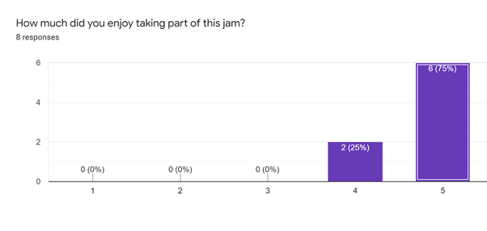
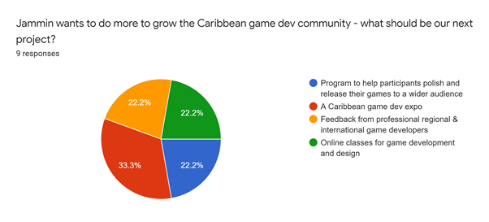

Hey everyone!

Another year has passed and we had another game jam for Caribbean people \- Jammin 2021! Here's a demo reel of all the games we created: <a href="https://www.youtube.com/watch?v=fiCOIeDXIrg" target="_blank" rel="nofollow noopener noreferrer">https://www.youtube.com/watch?v=fiCOIeDXIrg</a>.

Also, big up the winner SunshineQueen for her entry - <a href="https://sunshinequeen.itch.io/emily-all-alone" target="_blank" rel="nofollow noopener noreferrer">Emily All Alone</a>!

## Jammin's Story So Far

Jammin was created to be a space for aspiring and professional game developers in the Caribbean to show their talent and be part of a community. Software development is now becoming a more accepted pathway for Caribbean youth, game development still has some way to go.

The <a href="https://itch.io/jam/jammin-2019" target="_blank" rel="nofollow noopener noreferrer">first Jammin</a> game jam took place on August 1st, 2019, and lasted two weeks. The theme for the jam was growth, based on our goals for the region of course. Out of 10 participants, we got <a href="https://itch.io/jam/jammin-2019/results" target="_blank" rel="nofollow noopener noreferrer">3 game entries</a>. As the three best-ranked games won prizes, all participants were winners! Most of the promotion was done through the <a href="https://www.facebook.com/groups/devcarib" target="_blank" rel="nofollow noopener noreferrer">Caribbean Developers Facebook Group</a>, and private messaging people I thought would be interested. That's likely why participation was overrepresented by Trinbagonians, even despite efforts to reach people outside my home country.

In 2020, we may not have had Jammin at all. Coronavirus was in full effect, and our lives were turned upside down. A lot was happening and I wasn't sure if I'd have the time to host another one, the first game jam was taxing! After some encouragement and letting some other activities go, <a href="https://itch.io/jam/jammin-2020" target="_blank" rel="nofollow noopener noreferrer">Jammin 2020</a> kicked off in December! I recently bought an Arduboy, fell in love with C++ again, and created a game. The enthusiasm and feedback I got from the community really helped me out in my game dev journey. As such, the theme was 1-bit \- and the top prize was an Arduboy! This time, we got 15 participants (50% growth!) but still just <a href="https://itch.io/jam/jammin-2020/results" target="_blank" rel="nofollow noopener noreferrer">3 game entries</a>. There was a heavy promotion on Facebook once again, and a lot of Facebook DMs to get it noticed. However, I got a lot more mileage by sharing on Reddit! Twitter got some love too, those were major changes that helped out.

Now we just had <a href="https://itch.io/jam/jammin-2021" target="_blank" rel="nofollow noopener noreferrer">Jammin 2021</a>. It was our biggest year yet, with 28 participants (87% growth!) and <a href="https://itch.io/jam/jammin-2021" target="_blank" rel="nofollow noopener noreferrer">11 entries!</a>. Still quite a few Trinbagonians, but the winner was Jamaican! There were also participants from Grenada, diaspora in the UK and a few people joined from outside the region - Philippines, Lithuania, Bangladesh, and India! It was great to see the community so active and so many games come out - it beat my expectations and for the first time, I created an entry for my own jam! Reddit and Twitter were the focus of my promotions. I'm also involved in a lot more discord groups for game devs, so I shared it there and got good traction. As the jam got more popular, the platform highlights it more to game devs looking for jams.

## What Worked Better This Time?

It's the third year running, what was once novel is now routine. Every time we host, we spread the word and that gets more people in next time. I spend less time promoting the jam because I know how to reach out to the community: Reddit -> Discord -> Twitter -> Facebook (Game Developers Jamaica/T&T groups, Caribbean Developers). This is now a process, which is great.

The prizes are getting juicier! Jammin is something I do out of pocket. As my career grows, so does my disposable income, and so does my ability to provide better incentives to come first. This year, through pure luck and goodwill, the first prize was bumped up to **$200 USD** and sponsored by <a href="http://wepala.com/" target="_blank" rel="nofollow noopener noreferrer">Wepala</a>!

One of the key changes that worked out well was changing how the judging was done. Before we would ask non-participants to be judges. This was unreliable (someone always bails, part of life). I decided this year to let the community vote for itself. Although I didn't know we would have this many participants with entries, it worked out really well. The main goal of this switch was to encourage participants to play each other's games and give feedback. That's a key component to becoming better game devs.

As I was able to better manage my time while setting up Jammin, I did a couple of post-jam activities that were completely new. One was creating a video of all the games that were submitted. This is super important for the participants - they got an awesome reference to the wonderful games they created. I also figured that a video was a better way to promote the results of Jammin rather than sharing a link with the rankings. If people saw how amazing these games are, they'd be more excited to play them.

The second activity I did was create a form to get feedback from the participants. My opinion and perspective could never capture the entire experience or motivations of everyone. I really wanted to see how this initiative can help them realize their dreams, and make us more visible in and out of the region. The participants really liked it:

When asked *"Why did you join this jam?"*, here are the responses:

> I joined this jam because I've participated in the jam since its first iteration and I provide an opportunity for game developers across the Caribbean and the Caribbean diaspora to hone, developed, and sharpen their development skills from the ground up.

> To practice my skills and make a cool game

> I was intrigued. And wanted to see how far 2 months of experience can take me.

> I'm a beginner. So to push myself in creating games in a short time and to check out my performance among other devs.

> Because jams are fun

> I am learning C# language and game design so, I just want to test my knowledge and having fun by doing it so I join this jam. (and also the theme is unique so I like to join it)

> To meet other Caribbean persons interested in Game Jams

> Defending my title ;)

> To experience my first game jam!

My heart got all warm and fuzzy!

## What Could Have Been Done Better?

There's always room for improvement. For one, this game jam isn't regional enough. There's still an abundance of Trinbagonian participation, which isn't something I'm against. We've gotten participation from a lot more Caribbean territories than before, but there's a lot to do here still. Particularly in attracting our family from the non-English speaking Caribbean.

From the participant feedback, more promotion was requested. A game dev always wants their games to reach as huge an audience as possible. I think this could be done in two ways: of course, making connections to media personnel regionally, but also teaching game devs how to promote their own games. It's an important skill to master, especially if you're going the indie route (and with the lack of game dev companies operating regionally, this is our most likely option right now).

And more could be done to keep the community on Discord active. Social media is not something I spend loads of time on, intentionally. But it's a major conduit to fostering the community, especially in a pandemic. This is something I'll be getting help with!

## What's Next?

Things are setting up for Jammin 2022 already. Jammin will be getting its own website to help with its visibility and branding that's separate from my own. I want this to live for the region, even if I'm not the one hosting it.

We'll also be hosting a 3-day game jam inNovember before exams hit students really hard. It may be called "Toast", who knows?

We asked participants what they wanted to see from us next, and here's what they said:

A game dev expo sounds like a lot! It's not something I'll do by myself, but it would massively shine a light on Caribbean game development \- so it's definitely worth it to me. And just like this game jam, it can start small and be small. We'll just make games and grow the community.

Happy gaming everyone!
