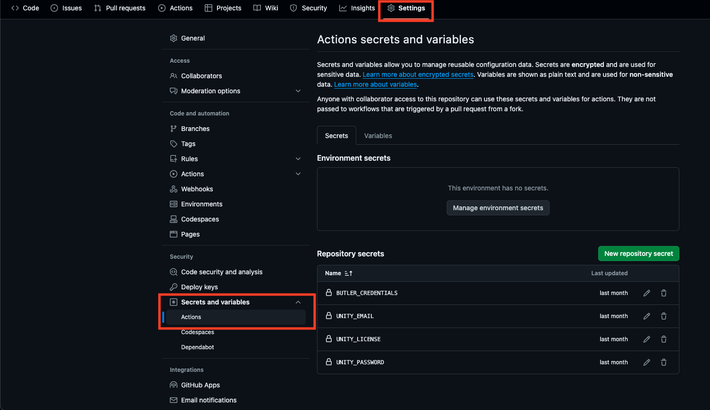
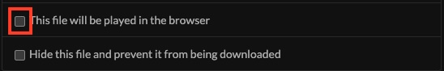

We're all too old to make manual builds over and over again. Let's free up some local computer resources and build in the cloud! Here's the YAML file that automatically uploads my Unity games to itch.io:

```yaml
name: Build and deploy

on:
  push:
    branches:
      - main

jobs:
  buildAndTestForLinuxBasedPlatforms:
    name: Build for ${{ matrix.targetPlatform }}
    runs-on: ubuntu-24.04
    strategy:
      fail-fast: false
      matrix:
        projectPath:
          - ./
        unityVersion:
          - 2022.3.12f1
        targetPlatform:
          - WebGL
    steps:
      - uses: actions/checkout@v4
        with:
          fetch-depth: 0
      - uses: actions/cache@v3
        with:
          path: ${{ matrix.projectPath }}/Library
          key:
            Library-${{ matrix.projectPath }}-${{ matrix.targetPlatform }}-${{
            hashFiles(matrix.projectPath) }}
          restore-keys: |
            Library-${{ matrix.projectPath }}-${{ matrix.targetPlatform }}-
            Library-${{ matrix.projectPath }}-
            Library-
      - uses: game-ci/unity-builder@v4
        env:
          UNITY_LICENSE: ${{ secrets.UNITY_LICENSE }}
          UNITY_EMAIL: ${{ secrets.UNITY_EMAIL }}
          UNITY_PASSWORD: ${{ secrets.UNITY_PASSWORD }}
        with:
          projectPath: ${{ matrix.projectPath }}
          unityVersion: ${{ matrix.unityVersion }}
          targetPlatform: ${{ matrix.targetPlatform }}
          buildName: Reduction
      - uses: actions/upload-artifact@v4
        with:
          name: Build
          path: build
          retention-days: 1
      - uses: manleydev/butler-publish-itchio-action@v1.0.3
        env:
          BUTLER_CREDENTIALS: ${{ secrets.BUTLER_CREDENTIALS }}
          CHANNEL: html5
          ITCH_GAME: ${{ vars.ITCH_GAME }}
          ITCH_USER: ${{ vars.ITCH_USER }}
          PACKAGE: build
```

This can work with any Unity project on GitHub Actions. You need 4 secrets:

- **UNITY_LICENSE** - Follow the guide to get this, as it's a bit more difficuly for personal licenses: <https://game.ci/docs/github/activation/>
- **UNITY_EMAIL**
- **UNITY_PASSWORD**
- **BUTLER_CREDENTIALS** - On itch.io, create API keys on this page: <https://itch.io/user/settings/api-keys>

And 2 variables:

- **ITCH_GAME** - The URL slug of your project e.g. `https://<YOUR_USER>.itch.io/<YOUR_GAME>`, use the last part of the URL
- **ITCH_USER** - Your username

You can configure these in your project's settings page -> Secrets and variables -> Actions:



**Note**: For web builds, once the first build is pushed up, you need to head over to your itch.io's project page. Under the "Uploads" section, select the checkbox to indicate the build is going to be played in the browser


