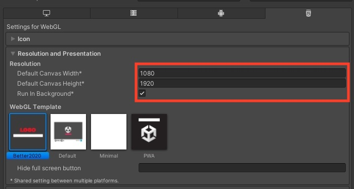
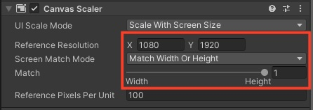
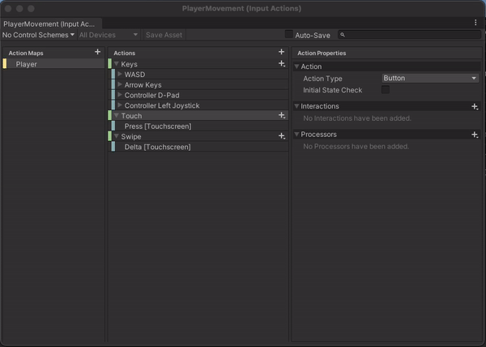
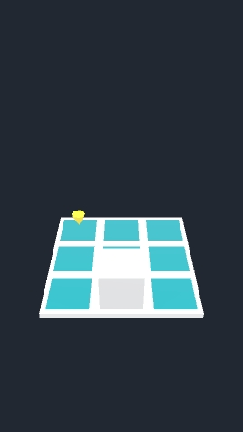

I recently learned how to move a player via touch screen swipes in Unity, and thought I'd share how and why I've done it!

While hosting the yearly [Jammin game jam](https://itch.io/jam/jammin-2024), and as part of my pre-game jam routine, I like to do some sort of warm up in the engine of choice. I've generally been into Unity more than Godot, mostly because of my day job which uses it, so I decided to warm up by looking at some older Unity projects of mine.

Reduction is a tech demo I created before entering the [GameDev.tv 2022 Game Jam](https://itch.io/jam/gamedevtv-jam-2022), I just wanted to see how easy it was to get [MagicaVoxel](https://ephtracy.github.io/) models inside Unity. It's something that could be played in 10 seconds:

<blockquote class="instagram-media" data-instgrm-captioned data-instgrm-permalink="https://www.instagram.com/reel/CiZ0aKUtenA/?utm_source=ig_embed&amp;utm_campaign=loading" data-instgrm-version="14" style=" background:#FFF; border:0; border-radius:3px; box-shadow:0 0 1px 0 rgba(0,0,0,0.5),0 1px 10px 0 rgba(0,0,0,0.15); margin: 1px; max-width:540px; min-width:326px; padding:0; width:99.375%; width:-webkit-calc(100% - 2px); width:calc(100% - 2px);"><div style="padding:16px;"> <a href="https://www.instagram.com/reel/CiZ0aKUtenA/?utm_source=ig_embed&amp;utm_campaign=loading" style=" background:#FFFFFF; line-height:0; padding:0 0; text-align:center; text-decoration:none; width:100%;" target="_blank"> <div style=" display: flex; flex-direction: row; align-items: center;"> <div style="background-color: #F4F4F4; border-radius: 50%; flex-grow: 0; height: 40px; margin-right: 14px; width: 40px;"></div> <div style="display: flex; flex-direction: column; flex-grow: 1; justify-content: center;"> <div style=" background-color: #F4F4F4; border-radius: 4px; flex-grow: 0; height: 14px; margin-bottom: 6px; width: 100px;"></div> <div style=" background-color: #F4F4F4; border-radius: 4px; flex-grow: 0; height: 14px; width: 60px;"></div></div></div><div style="padding: 19% 0;"></div> <div style="display:block; height:50px; margin:0 auto 12px; width:50px;"><svg width="50px" height="50px" viewBox="0 0 60 60" version="1.1" xmlns="https://www.w3.org/2000/svg" xmlns:xlink="https://www.w3.org/1999/xlink"><g stroke="none" stroke-width="1" fill="none" fill-rule="evenodd"><g transform="translate(-511.000000, -20.000000)" fill="#000000"><g><path d="M556.869,30.41 C554.814,30.41 553.148,32.076 553.148,34.131 C553.148,36.186 554.814,37.852 556.869,37.852 C558.924,37.852 560.59,36.186 560.59,34.131 C560.59,32.076 558.924,30.41 556.869,30.41 M541,60.657 C535.114,60.657 530.342,55.887 530.342,50 C530.342,44.114 535.114,39.342 541,39.342 C546.887,39.342 551.658,44.114 551.658,50 C551.658,55.887 546.887,60.657 541,60.657 M541,33.886 C532.1,33.886 524.886,41.1 524.886,50 C524.886,58.899 532.1,66.113 541,66.113 C549.9,66.113 557.115,58.899 557.115,50 C557.115,41.1 549.9,33.886 541,33.886 M565.378,62.101 C565.244,65.022 564.756,66.606 564.346,67.663 C563.803,69.06 563.154,70.057 562.106,71.106 C561.058,72.155 560.06,72.803 558.662,73.347 C557.607,73.757 556.021,74.244 553.102,74.378 C549.944,74.521 548.997,74.552 541,74.552 C533.003,74.552 532.056,74.521 528.898,74.378 C525.979,74.244 524.393,73.757 523.338,73.347 C521.94,72.803 520.942,72.155 519.894,71.106 C518.846,70.057 518.197,69.06 517.654,67.663 C517.244,66.606 516.755,65.022 516.623,62.101 C516.479,58.943 516.448,57.996 516.448,50 C516.448,42.003 516.479,41.056 516.623,37.899 C516.755,34.978 517.244,33.391 517.654,32.338 C518.197,30.938 518.846,29.942 519.894,28.894 C520.942,27.846 521.94,27.196 523.338,26.654 C524.393,26.244 525.979,25.756 528.898,25.623 C532.057,25.479 533.004,25.448 541,25.448 C548.997,25.448 549.943,25.479 553.102,25.623 C556.021,25.756 557.607,26.244 558.662,26.654 C560.06,27.196 561.058,27.846 562.106,28.894 C563.154,29.942 563.803,30.938 564.346,32.338 C564.756,33.391 565.244,34.978 565.378,37.899 C565.522,41.056 565.552,42.003 565.552,50 C565.552,57.996 565.522,58.943 565.378,62.101 M570.82,37.631 C570.674,34.438 570.167,32.258 569.425,30.349 C568.659,28.377 567.633,26.702 565.965,25.035 C564.297,23.368 562.623,22.342 560.652,21.575 C558.743,20.834 556.562,20.326 553.369,20.18 C550.169,20.033 549.148,20 541,20 C532.853,20 531.831,20.033 528.631,20.18 C525.438,20.326 523.257,20.834 521.349,21.575 C519.376,22.342 517.703,23.368 516.035,25.035 C514.368,26.702 513.342,28.377 512.574,30.349 C511.834,32.258 511.326,34.438 511.181,37.631 C511.035,40.831 511,41.851 511,50 C511,58.147 511.035,59.17 511.181,62.369 C511.326,65.562 511.834,67.743 512.574,69.651 C513.342,71.625 514.368,73.296 516.035,74.965 C517.703,76.634 519.376,77.658 521.349,78.425 C523.257,79.167 525.438,79.673 528.631,79.82 C531.831,79.965 532.853,80.001 541,80.001 C549.148,80.001 550.169,79.965 553.369,79.82 C556.562,79.673 558.743,79.167 560.652,78.425 C562.623,77.658 564.297,76.634 565.965,74.965 C567.633,73.296 568.659,71.625 569.425,69.651 C570.167,67.743 570.674,65.562 570.82,62.369 C570.966,59.17 571,58.147 571,50 C571,41.851 570.966,40.831 570.82,37.631"></path></g></g></g></svg></div><div style="padding-top: 8px;"> <div style=" color:#3897f0; font-family:Arial,sans-serif; font-size:14px; font-style:normal; font-weight:550; line-height:18px;">View this post on Instagram</div></div><div style="padding: 12.5% 0;"></div> <div style="display: flex; flex-direction: row; margin-bottom: 14px; align-items: center;"><div> <div style="background-color: #F4F4F4; border-radius: 50%; height: 12.5px; width: 12.5px; transform: translateX(0px) translateY(7px);"></div> <div style="background-color: #F4F4F4; height: 12.5px; transform: rotate(-45deg) translateX(3px) translateY(1px); width: 12.5px; flex-grow: 0; margin-right: 14px; margin-left: 2px;"></div> <div style="background-color: #F4F4F4; border-radius: 50%; height: 12.5px; width: 12.5px; transform: translateX(9px) translateY(-18px);"></div></div><div style="margin-left: 8px;"> <div style=" background-color: #F4F4F4; border-radius: 50%; flex-grow: 0; height: 20px; width: 20px;"></div> <div style=" width: 0; height: 0; border-top: 2px solid transparent; border-left: 6px solid #f4f4f4; border-bottom: 2px solid transparent; transform: translateX(16px) translateY(-4px) rotate(30deg)"></div></div><div style="margin-left: auto;"> <div style=" width: 0px; border-top: 8px solid #F4F4F4; border-right: 8px solid transparent; transform: translateY(16px);"></div> <div style=" background-color: #F4F4F4; flex-grow: 0; height: 12px; width: 16px; transform: translateY(-4px);"></div> <div style=" width: 0; height: 0; border-top: 8px solid #F4F4F4; border-left: 8px solid transparent; transform: translateY(-4px) translateX(8px);"></div></div></div> <div style="display: flex; flex-direction: column; flex-grow: 1; justify-content: center; margin-bottom: 24px;"> <div style=" background-color: #F4F4F4; border-radius: 4px; flex-grow: 0; height: 14px; margin-bottom: 6px; width: 224px;"></div> <div style=" background-color: #F4F4F4; border-radius: 4px; flex-grow: 0; height: 14px; width: 144px;"></div></div></a><p style=" color:#c9c8cd; font-family:Arial,sans-serif; font-size:14px; line-height:17px; margin-bottom:0; margin-top:8px; overflow:hidden; padding:8px 0 7px; text-align:center; text-overflow:ellipsis; white-space:nowrap;"><a href="https://www.instagram.com/reel/CiZ0aKUtenA/?utm_source=ig_embed&amp;utm_campaign=loading" style=" color:#c9c8cd; font-family:Arial,sans-serif; font-size:14px; font-style:normal; font-weight:normal; line-height:17px; text-decoration:none;" target="_blank">A post shared by GameBoyMarcus (@gameboymarcus)</a></p></div></blockquote> <script async src="//www.instagram.com/embed.js"></script>

I always felt it had the potential to be a casual mobile game. So, why not make it one? This is how I converted this 10 second, desktop-only tech demo into a 10 second, mobile friendly one (it's not a priority project).

## Resolution

The game was originally had a 1920x1080 resolution by default. The most popular mobile games on the play store are in portrait mode (don't take my word for it, look at the most popular games yourself: <https://www.similarweb.com/top-apps/google/games/>), and as a player, unless it's an action/adventure game, I prefer playing mobiles games in portrait mode.

So we first change the reference resolutions in the Player settings:



And we had to change the reference resolution for a canvas we had on the screen, and the scaling mode so we scale by height instead:



## Input

Unity's makes it dead easy to support mobile touch buttons and joysticks to play your games on the go. They also do a good job of making swipe support easy to add. As it's a puzzler where the player only has to move around, swiping provides a better experience that moving a touch screen joystick or d-pad.

We add a new input action for touch presses:



We use both the touch and swipe actions to determine where the player moves while swiping. How?

First we'll listen to those input events

```csharp
void OnEnable()
{
    input.Enable();
    input.Player.Keys.performed += OnMovementPerformed;
    input.Player.Keys.canceled += OnMovementCancelled;
    // New event subscriptions
    input.Player.Swipe.performed += OnSwipeDeltaPerformed;
    input.Player.Touch.canceled += OnTouchCancelled;
}

void OnDisable()
{
    input.Disable();
    input.Player.Keys.performed -= OnMovementPerformed;
    input.Player.Keys.canceled -= OnMovementCancelled;
    // Remove when the Monobehaviour is disabled
    input.Player.Swipe.performed -= OnSwipeDeltaPerformed;
    input.Player.Touch.canceled -= OnTouchCancelled;
}
```

And then we process the swipe input. We start by getting the delta of the touch movement:

```csharp
// First get the delta of the swipe
private void OnSwipeDeltaPerformed(InputAction.CallbackContext context)
{
    swipeDirection = context.ReadValue<Vector2>();
}
```

And then we get the magnitude of the movement, checking if it was an intentional swipe we should act upon. If it is intentional, move the player depending on the strongest direction of the swipe.

```csharp
private void OnTouchCancelled(InputAction.CallbackContext context)
{
    // Ignore if swipe isn't strong enough
    if (Mathf.Abs(swipeDirection.magnitude) < minimumSwipeMagnitude) return;

    if (moving || gameOver) return; // No new inputs while moving

    if (Mathf.Abs(swipeDirection.y) > Mathf.Abs(swipeDirection.x))
    {
        moveVector = new Vector2(0, swipeDirection.y > 0 ? 1 : -1);
    }
    else
    {
        moveVector = new Vector2(swipeDirection.x > 0 ? 1 : -1, 0);
    }

    // Shared function between this movement and keyboard movement logic
    DetermineTargetPosition(moveVector);
}
```

Note that there are a few variables and functions not defined in the code. If you're copying for your own game:

- `minimumSwipeMagnitude` is a float, experiment with how sensitive you need your movement to be
- `swipeDirection` is a private, Vector2 variable
- `DetermineTargetPosition` is a function that works for swipe and keyboard input

And that's the bulk of the work!

## Conclusion

In theory, taking a simple PC game and adding mobile support is straightforward. Of course, this particular game lends itself to mobile. If your game can support portrait mode, you're already one step ahead. The new input system can facilitate all sorts of input options - include touch input which isn't as discrete as a gamepad.

You'll still likely have to tweak UI elements to adapt to mobile, but here's how it looks like a mobile game:




Happy game deving everyone!
